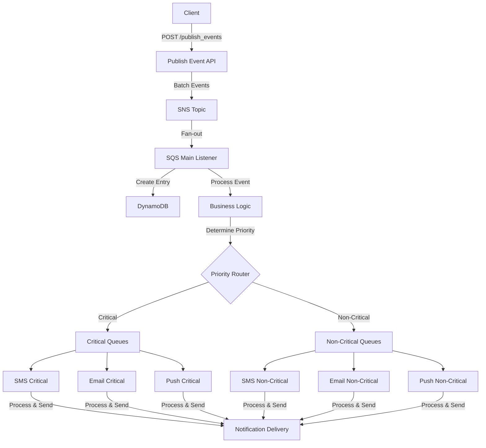

# Event-Driven Notification System

A resilient and scalable event-driven notification system built with Python that handles notifications for social media platforms, supporting push notifications, emails, and SMS alerts based on user activities.

## Architecture Overview

The system is built on a microservices architecture, leveraging AWS services for scalability and resilience:

```
notification-system/
├── src/
│   ├── api/              # FastAPI application endpoints
│   ├── services/         # Core notification services
│   ├── models/           # Data models and type definitions
│   ├── config/           # Configuration and settings
│   ├── infrastructure/   # AWS/LocalStack setup
│   └── utils/            # Shared utilities
└── tests/                # Test suite with Locust load tests
```

### Key Components
- **Amazon SQS**: Message queuing and decoupling
- **AWS Lambda/EC2/ECS**: Message processing
- **Amazon DynamoDB**: Metadata and status storage
- **CloudWatch**: Performance monitoring and autoscaling
- **SNS/Third-party APIs**: Notification delivery

## Features

- **Multi-Channel Notifications**
  - Email notifications via SendGrid
  - SMS notifications via Twilio
  - Push notifications via Firebase/APNs
  - User-configurable notification preferences
  
- **Priority-Based Processing**
  - Critical and non-critical queues for each channel
  - Priority-based message routing
  - Dead Letter Queue (DLQ) for failed messages
  - Quiet hours support for non-critical notifications
  - Priority-only mode for users

- **Robust Error Handling**
  - Exponential backoff retry mechanism
  - Comprehensive error logging
  - Failed message recovery

- **Scalability**
  - Horizontal scaling with multiple workers
  - Parallel message processing
  - Supervisor-managed processes
  - Load balanced FastAPI service (up to 10K req/s per instance)
  - Auto-scaled worker pools (3-5 workers per CPU core)

## User Preferences

Users can configure their notification preferences:

```json
{
    "notification_preferences": {
        "sms": true,
        "email": true,
        "push": true,
        "quiet_hours": {
            "enabled": true,
            "start": "22:00",
            "end": "08:00"
        },
        "priority_only": false
    }
}
```

- **Channel Selection**: Enable/disable SMS, email, or push notifications
- **Quiet Hours**: Suppress non-critical notifications during specified hours
- **Priority Mode**: Receive only critical notifications when enabled

## Performance & Scaling

The system is designed to handle high throughput:

- **API Layer**:
  - Each FastAPI instance: ~10,000 requests/second
  - Load balanced across multiple instances
  - Recommended: N workers = N CPU cores
  - Example: 8 core machine = 8 uvicorn workers

- **Worker Processing**:
  - 1 worker per CPU core for optimal performance
  - Prevents CPU context switching overhead
  - Each worker handles ~1,000 messages/second
  - Auto-scales based on queue depth
  - Example: 8 core machine = 8 workers × 1,000 msg/s = 8,000 msg/s throughput

## Core Components

### 1. Main Application (`src/api/main.py`)
- Entry point for FastAPI application
- Handles HTTP requests for event publishing
- Provides event status endpoints
- Implements WebSocket connections

### 2. Data Models (`src/models/`)
- `event.py`: Event status and payload definitions
- `event_types.py`: Supported event type enumerations
- `user_types.py`: User role definitions

### 3. Services (`src/services/`)
#### Email Service (`email_service.py`)
- SendGrid integration
- Priority-based email processing
- Retry mechanism with backoff

#### SMS Service (`sms_service.py`)
- Twilio integration
- Critical message prioritization
- Status tracking and updates

#### Push Notification Service (`push_service.py`)
- Firebase/APNs integration
- Device token management
- Platform-specific payload handling

### 4. Infrastructure (`src/infrastructure/`)
- LocalStack resource setup
- Queue creation and configuration
- DynamoDB table management

## System Flow

### Flow Chart


1. **Event Triggering**
   - User activity triggers event via POST /publish_events API
   - Events are batched and published to SNS topic

2. **Message Processing**
   - SQS listener creates initial event entry in DynamoDB
   - Business logic computes event criticality
   - Events routed to appropriate priority queues

3. **Priority-Based Routing**
   - Separate critical and non-critical queues for each channel (SMS/Email/Push)
   - Channel-specific processors handle delivery
   - Status updates tracked in DynamoDB

4. **Notification Delivery**
   - Channel-specific services process their respective queues
   - Delivery via Twilio (SMS), SendGrid (Email), and Firebase/APNs (Push)
   - Failed deliveries retry with exponential backoff

## API Usage

### Publish Event API

The main entry point for triggering notifications is the `/publish_events` endpoint:

```bash
# Using curl
curl -X POST http://localhost:8000/publish_events \
  -H "Content-Type: application/json" \
  -d '{
    "user_id": "user_12345",
    "event_type": "LIKE",
    "payload": {
      "parent_id": "post_67890",
      "parent_type": "post",
      "timestamp": "2023-10-15T12:34:56Z",
      "priority": "critical"
    }
  }'

# Using Python requests
import requests
requests.post(
    'http://localhost:8000/event',
    json={
        "user_id": "user_12345",
        "event_type": "LIKE",
        "payload": {
            "parent_id": "post_67890",
            "parent_type": "post",  
            "timestamp": "2023-10-15T12:34:56Z",
            "priority": "critical"
        }
    }
)
```

### Load Testing with Locust

The repository includes a Locust file for load testing the event publishing API:

```python
# tests/locustfile.py example usage
locust -f tests/locustfile.py --host http://localhost:8000
```

Then visit http://localhost:8089 to access the Locust web interface.

### Event Types

Supported event types for notifications:
- LIKE
- COMMENT
- SHARE
- FOLLOW
- UNFOLLOW
- MENTION
- MESSAGE
- POST

### Response Format

```json
{
    "event_id": "1234567890",
    "status": "SUCCESS",
    "message": "Event published successfully"
}
```

## Local Development Setup

1. **Environment Setup**
```bash
# Create virtual environment
python -m venv venv
source venv/bin/activate  # On Windows: venv\Scripts\activate

# Install dependencies
pip install -r requirements.txt
```

2. **LocalStack Setup**
```bash
# Start LocalStack
localstack start

# Verify services
localstack status services

# Setup resources
python -m src.infrastructure.setup_localstack
```

3. **Start Services**
```bash
# Start supervisor
supervisord -c supervisord.conf

# Check status
supervisorctl status
```

4. **Run API Server**
```bash
uvicorn src.api.main:app --reload --port 8000 --host 0.0.0.0 --workers 3
```

5. **Load Testing**
```bash
# Run Locust tests
locust -f tests/locustfile.py --host http://localhost:8000
```

## Monitoring

- **Service Status**: `supervisorctl status`
- **Logs**: `/tmp/sqs_listener*.log`
- **Metrics**: CloudWatch dashboards
- **Performance**: Locust reports

### Observability Stack

The system uses a comprehensive observability stack:

#### 1. OpenTelemetry Collector
- Central collector for all telemetry data
- Protocol: OTLP (OpenTelemetry Protocol)
- Ports:
  - 4317: OTLP gRPC
  - 4318: OTLP HTTP
  - 8888: Collector Metrics

#### 2. Prometheus
- Metrics collection and storage
- Scrape interval: 15s
- Endpoints monitored:
  - `notification-system:8001`: Application metrics
  - `otel-collector:8889`: Collector metrics

#### 3. Grafana
- Visualization and dashboards
- URL: http://localhost:3000 (admin/admin)
- Pre-configured dashboards:
  - Notification Count by Type
  - Processing Duration
  - Queue Depth

### Key Metrics

1. **Notification Metrics**
   - `notification_count`: Total notifications by type
   - `notification_duration`: Processing time in milliseconds
   - `queue_depth`: Current queue size

2. **Performance Metrics**
   - Batch processing times
   - Queue processing rates
   - Error rates by notification type

### Monitoring Setup

```bash
# Start monitoring stack
docker-compose -f docker-compose.monitoring.yml up -d

# Verify services
docker-compose -f docker-compose.monitoring.yml ps

# Check logs
docker-compose -f docker-compose.monitoring.yml logs -f
```

### Additional Monitoring
- **Service Status**: `supervisorctl status`
- **Application Logs**: `/tmp/sqs_listener*.log`
- **Load Testing**: Locust reports at http://localhost:8089

## Security

See [SECURITY.md](SECURITY.md) for:
- Supported versions
- Security measures
- Vulnerability reporting

## API Documentation

Available at `/docs` when running the server:
- Event publishing
- Status checking
- Subscription management

## Contributing

1. Fork the repository
2. Create feature branch
3. Commit changes
4. Push to branch
5. Create Pull Request

## License

This project is licensed under the MIT License - see the [LICENSE](LICENSE) file for details.

## Authors

- Initial work - Keshav Garg

## Acknowledgments

- FastAPI
- LocalStack
- AWS Services
- SendGrid
- Twilio


